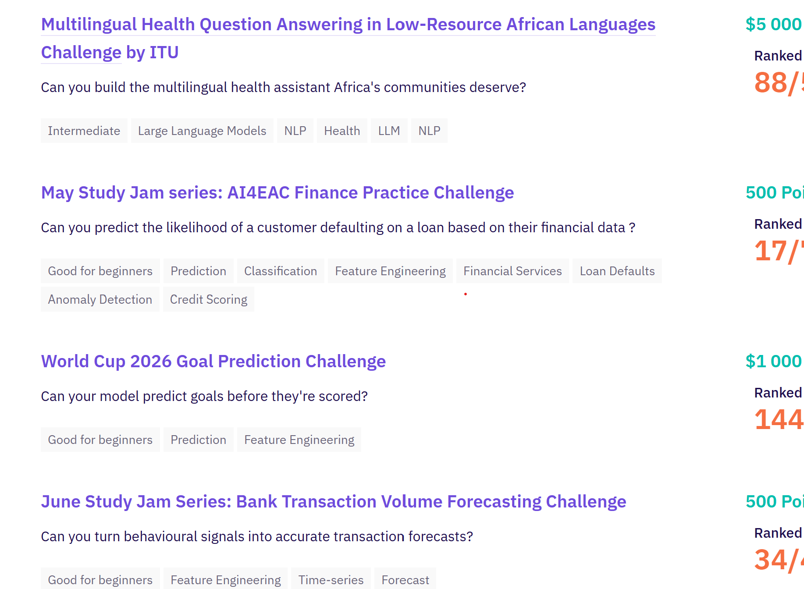

<h1 align="center">Data Scientist · Machine Learning & LLM Engineering</h1>

  <i>Building end-to-end ML pipelines from feature engineering to production deployment</i>

  

---

## 🚀 Technical Focus

- 🧠 **Core actuel :** Computer Vision (classification d'images), NLP multilingue & fine-tuning de LLM (LoRA/QLoRA), scoring de crédit & détection de fraude
- ⚙️ **Architecture :** Pipelines ML reproductibles — feature engineering, stacking multi-modèles, déploiement FastAPI + Docker + Cloud Run
- 🌍 **Spécialisation :** Modèles pour contextes à données limitées — domain shift cross-pays, langues africaines à faibles ressources
- 🏆 **Compétitions :** Zindi Africa, Kaggle, IOAI 2026, ITU x Zindi

- 📫 **Contact :** [dimkhaa777@outlook.fr](mailto:dimkhaa777@outlook.fr)
- 💼 **Profil pro :** [LinkedIn](https://linkedin.com/in/khadimgueye1)

---

## 🔄 Actuellement

**Bank Transaction Volume Forecasting Challenge** — Zindi, June Study Jam Series
*Transformer des signaux comportementaux en prévisions de volumes de transactions* · séries temporelles · classement provisoire en cours

---

## 🌟 High-Leverage Projects

| Projet | Description | Stack |
|---|---|---|
| 🏔️ **[Natural Scene Classification](https://github.com/gueye001/natural-scene-classification)** | Classification d'images en 6 catégories · ensemble EfficientNetV2 + ConvNeXt · 4e/compétition IOAI 2026 · F1 Micro : 0.9570 | PyTorch, timm, FastAPI, Docker, Cloud Run |
| 🌍 **[African Health QA](https://github.com/gueye001/african-health-qa)** | QA santé en langues africaines à faibles ressources (Luganda, Amharique, Akan, Swahili) · fine-tuning LoRA Llama-3.1-8B + pipeline RAG (BGE-M3, FAISS, reranking) · 88e/1595 — ITU x Zindi | Llama-3.1, LoRA, FAISS, RAG, BGE-M3 |
| 💰 **[Africa Credit Scoring](https://github.com/gueye001/Africa-Credit-Scoring-Challenge)** | Prédiction de défaut de prêt avec domain shift Kenya → Ghana · 17e/151 · stacking multi-granularité LightGBM/XGBoost/RF/CatBoost · F1 : 0.6805 | LightGBM, XGBoost, FastAPI, Docker |

---

## 🔄 Actuellement

- **Bank Transaction Volume Forecasting Challenge** (Zindi, June Study Jam) — prévision de volumes de transactions bancaires à partir de signaux comportementaux · séries temporelles · classement provisoire : 34e · compétition en cours

---

## 🛠️ Tech Stack & Infrastructure

  

  
  
  
  
  
  
  
  
  
  

---

## 🔗 Connect & Review Code

  
  
  
  

---

## ⚡ Operating Principles

- Une métrique élevée en local ne veut rien dire sans validation sur données réelles (domain shift, langues rares, déséquilibre de classes)
- Un modèle n'est terminé que lorsqu'il est déployé et accessible — FastAPI, Docker, Cloud Run, HuggingFace Spaces
- Les problèmes à faibles ressources (langues africaines, fraude rare, défaut de crédit) forcent une rigueur méthodologique supérieure
- Basé à Toulouse, en recherche active d'un poste Data Scientist / ML Engineer
